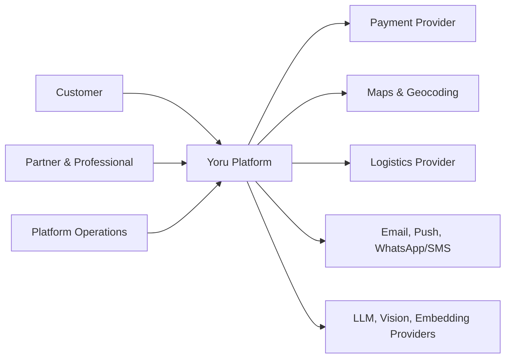
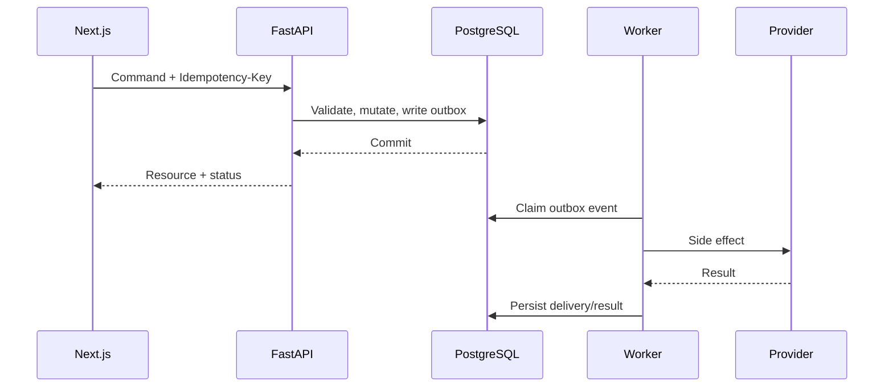

# Engineering Overview

## 1. Tujuan desain

Arsitektur Yoru dioptimalkan untuk:

- mempercepat delivery MVP tanpa mengorbankan batas domain;
- menjaga isolasi data partner;
- memisahkan transaksi produk, booking layanan, dan uang;
- memungkinkan AI berkembang tanpa menjadikan LLM sumber kebenaran;
- menyediakan jalur scale-out setelah pola traffic terbukti;
- mengurangi operational burden tim awal.

## 2. System context



## 3. Container view

| Container         | Tanggung jawab                                               | Tidak boleh                                            |
| ----------------- | ------------------------------------------------------------ | ------------------------------------------------------ |
| `apps/storefront` | Ecommerce customer, booking, account, tracking, AI advisor   | Menghitung harga/komisi sebagai authority              |
| `apps/console`    | Partner dashboard, professional workspace, admin operations  | Melewati permission API                                |
| `services/api`    | Business rules, auth, orchestration, transaction boundary    | Menjalankan job lama dalam request                     |
| `services/worker` | Outbox, webhook retry, notification, indexing, AI jobs       | Menjadi system of record                               |
| PostgreSQL        | Data transaksi, ledger, audit, state                         | Menyimpan file besar                                   |
| Redis             | Cache, rate-limit counter, ephemeral locks, job coordination | Menyimpan ledger/order sebagai satu-satunya copy       |
| Qdrant            | Semantic retrieval dengan tenant payload                     | Menyimpan raw image/PII atau angka finansial authority |
| Object storage    | Product assets, verification docs, private photo objects     | Public bucket untuk data sensitif                      |

## 4. Frontend boundaries

### Storefront

Route groups target:

```text
app/
├── (public)/
│   ├── products/
│   ├── services/
│   ├── partners/
│   └── search/
├── (auth)/
│   ├── login/
│   ├── register/
│   └── recovery/
├── (customer)/
│   ├── account/
│   ├── cart/
│   ├── checkout/
│   ├── orders/
│   ├── bookings/
│   ├── tracking/
│   └── assistant/
└── api/                     # BFF handlers only when required
```

### Console

```text
app/
├── (auth)/
├── partner/
│   ├── overview/
│   ├── catalog/
│   ├── inventory/
│   ├── services/
│   ├── professionals/
│   ├── orders/
│   ├── bookings/
│   ├── finance/
│   └── insights/
├── professional/
│   ├── jobs/
│   ├── schedule/
│   └── earnings/
└── admin/
    ├── partners/
    ├── verification/
    ├── transactions/
    ├── disputes/
    ├── payouts/
    ├── moderation/
    └── audit/
```

Shared UI tidak boleh berisi business rule. `packages/contracts` dihasilkan dari OpenAPI
dan menjadi boundary type antara frontend dan backend.

## 5. Backend modules

```text
services/api/app/
├── core/                    # config, DB, logging, security primitives
├── identity/                # user, credential, session, MFA
├── access/                  # role, permission, membership, policy
├── partners/                # onboarding, verification, service area
├── catalog/                 # product, variant, media, category
├── inventory/               # stock, reservation, movement
├── professionals/           # profile, credential, availability
├── services/                # service offering, duration, price
├── carts/                   # cart and quote
├── checkout/                # orchestration and price snapshot
├── orders/                  # product order
├── bookings/                # home-service booking
├── payments/                # intent, webhook, refund
├── fulfillment/             # shipment/tracking
├── dispatch/                # assignment and professional tracking
├── ledger/                  # commission, payable, payout, reversal
├── reviews/                 # review and moderation
├── disputes/                # complaint and resolution
├── notifications/           # template and delivery request
├── ai/                      # advisor/copilot orchestration and policy
├── analytics/               # deterministic metrics/read models
├── audit/                   # append-only audit events
└── main.py
```

Setiap modul idealnya memiliki:

```text
module/
├── api/                     # router + HTTP schemas
├── application/             # use cases and ports
├── domain/                  # entities, policies, domain events
├── infrastructure/          # ORM repositories and provider adapters
└── tests/
```

Tidak semua modul perlu domain model kompleks. Gunakan struktur secukupnya, tetapi
dependency harus mengarah dari infrastructure ke application/domain, bukan sebaliknya.

## 6. Request dan event flow



External side effects tidak dilakukan sebelum transaksi bisnis commit. Gunakan
transactional outbox agar event tidak hilang di antara commit dan publish.

## 7. Source-of-truth matrix

| Data                   | Source of truth                     | Derived/cache                                |
| ---------------------- | ----------------------------------- | -------------------------------------------- |
| User, role, membership | PostgreSQL                          | Redis session/cache                          |
| Product/service        | PostgreSQL                          | Redis/API cache, Qdrant embeddings           |
| Stock available        | PostgreSQL stock/reservation        | Redis read cache opsional                    |
| Order/booking state    | PostgreSQL                          | Search/read model                            |
| Payment state          | PostgreSQL setelah verified webhook | Provider reference                           |
| Ledger/balance         | PostgreSQL ledger entries           | Materialized balance                         |
| Live location          | Redis/time-series store sementara   | Last-known snapshot di PostgreSQL bila perlu |
| AI recommendation      | Request/result record terbatas      | Qdrant retrieval                             |
| Revenue insight        | SQL analytics snapshot              | LLM narrative                                |

## 8. Scalability strategy

Scale dilakukan berurutan:

1. optimalkan query dan index;
2. pisahkan read-heavy job ke worker;
3. tambah API replica stateless;
4. gunakan shared cache/tag invalidation;
5. replica PostgreSQL untuk analytics/read bila diperlukan;
6. partition tabel besar seperti audit/event/location;
7. promote tenant besar ke dedicated Qdrant shard;
8. ekstrak service hanya jika terdapat ownership, scaling, atau reliability boundary nyata.

## 9. Architectural decision records

ADR yang diterima:

- ADR-001: modular monolith untuk backend MVP.
- ADR-002: dua Next.js apps dalam satu monorepo.
- ADR-003: PostgreSQL sebagai source of truth.
- ADR-004: Redis hanya untuk state ephemeral/reconstructable.
- ADR-005: Qdrant untuk retrieval, AI provider terabstraksi.
- ADR-006: cookie-based session dengan rotating refresh token.
- ADR-007: RBAC + ABAC + tenant scope + RLS.
- ADR-008: transactional outbox untuk external side effect.
- ADR-009: immutable ledger dan reversal entry.
- ADR-010: product order dan service booking memiliki lifecycle berbeda.

Perubahan terhadap ADR memerlukan dokumen: context, options, decision, consequences,
migration path, dan rollback.
