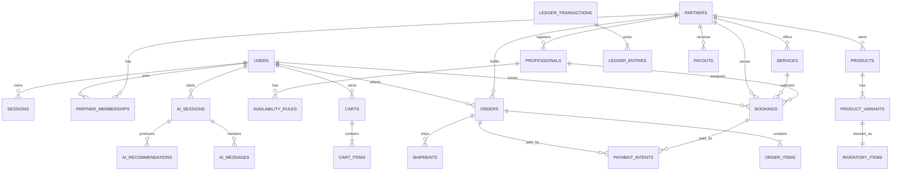

# Domain & Data Model

## 1. Domain rules utama

- `partner_id` menjadi tenant boundary untuk semua resource milik partner.
- Customer dapat bertransaksi dengan lebih dari satu partner hanya jika keputusan
  cross-partner cart telah disetujui.
- Harga, diskon, pajak, fee, dan komisi disimpan sebagai snapshot saat checkout.
- Product order dan service booking tidak berbagi satu status generik.
- Stock reservation memiliki expiry dan dilepas secara idempotent.
- Jadwal profesional tidak boleh overlap untuk booking berstatus aktif.
- Payment sukses hanya setelah webhook tervalidasi.
- Ledger append-only; refund/pembatalan menghasilkan reversal.
- AI hanya membaca data yang telah diotorisasi dan diminimalkan.

## 2. Aggregate

| Aggregate    | Root                    | Invariant                                       |
| ------------ | ----------------------- | ----------------------------------------------- |
| Identity     | `users`                 | Email/phone terverifikasi sesuai policy         |
| Partner      | `partners`              | Hanya partner terverifikasi dapat publish       |
| Catalog      | `products` / `services` | Variant/service price valid dan tenant-scoped   |
| Inventory    | `inventory_items`       | Available = on_hand - reserved, tidak negatif   |
| Professional | `professionals`         | Credential dan availability sesuai service      |
| Cart         | `carts`                 | Item aktif dan quote belum kedaluwarsa          |
| Order        | `orders`                | Totals dari server-side price snapshot          |
| Booking      | `bookings`              | Slot, area, dan professional assignment valid   |
| Payment      | `payment_intents`       | Provider transition idempotent                  |
| Ledger       | `ledger_transactions`   | Debit = credit per transaction                  |
| Dispute      | `disputes`              | Resolution memiliki actor dan evidence          |
| AI Session   | `ai_sessions`           | Consent, policy version, dan retention tercatat |

## 3. ERD inti



## 4. Table blueprint

Semua primary key menggunakan UUIDv7/ordered UUID bila library dan database strategy sudah
disetujui. Setiap tabel memiliki `created_at`, `updated_at` bila mutabel, dan actor/audit
metadata sesuai kebutuhan.

### Identity & access

| Table                 | Kolom penting                                   | Constraint/index awal         |
| --------------------- | ----------------------------------------------- | ----------------------------- |
| `users`               | id, email, phone, status, locale                | unique normalized email/phone |
| `user_credentials`    | user_id, password_hash, changed_at              | one active password           |
| `sessions`            | id, user_id, token_hash, expires_at, revoked_at | user + active expiry          |
| `mfa_methods`         | user_id, type, secret_ciphertext, verified_at   | encrypted secret              |
| `roles`               | id, code, scope                                 | unique code                   |
| `permissions`         | id, code                                        | unique code                   |
| `role_permissions`    | role_id, permission_id                          | composite unique              |
| `partner_memberships` | partner_id, user_id, role_id, status            | unique partner/user           |

### Partner & professional

| Table                      | Kolom penting                              | Constraint/index awal |
| -------------------------- | ------------------------------------------ | --------------------- |
| `partners`                 | id, legal_name, display_name, type, status | status + updated      |
| `partner_verifications`    | partner_id, type, status, reviewer_id      | partner + status      |
| `partner_documents`        | partner_id, kind, object_key, expires_at   | private object        |
| `service_areas`            | partner_id, type, geometry/postal_codes    | spatial/index policy  |
| `professionals`            | partner_id, user_id, status, rating        | unique membership     |
| `professional_credentials` | professional_id, kind, status, expires_at  | expiry index          |
| `availability_rules`       | professional_id, weekday, start/end        | valid time range      |
| `availability_exceptions`  | professional_id, start/end, reason         | range query           |

### Catalog, inventory, and service

| Table                    | Kolom penting                                       | Constraint/index awal |
| ------------------------ | --------------------------------------------------- | --------------------- |
| `categories`             | parent_id, type, slug, status                       | unique type/slug      |
| `products`               | partner_id, category_id, name, slug, status         | tenant + status       |
| `product_variants`       | partner_id, product_id, sku, price_minor            | unique partner/SKU    |
| `product_media`          | product_id, object_key, position                    | unique position       |
| `inventory_items`        | partner_id, variant_id, on_hand, reserved           | unique variant        |
| `inventory_movements`    | inventory_item_id, type, quantity, ref              | append-only           |
| `inventory_reservations` | variant_id, cart/order ref, qty, expires_at         | active expiry         |
| `services`               | partner_id, category_id, name, duration_min, status | tenant + status       |
| `service_prices`         | service_id, zone/type, price_minor, active          | valid date range      |

### Commerce and booking

| Table                    | Kolom penting                                                         | Constraint/index awal    |
| ------------------------ | --------------------------------------------------------------------- | ------------------------ |
| `carts`                  | customer_id, status, currency, expires_at                             | one active/cart policy   |
| `cart_items`             | cart_id, item_type, item_id, qty                                      | valid item ref           |
| `quotes`                 | cart_id, totals JSON/snapshot, expires_at                             | immutable snapshot       |
| `orders`                 | partner_id, customer_id, number, state, totals                        | partner + state + time   |
| `order_items`            | order_id, variant_id, snapshot, qty, totals                           | immutable snapshot       |
| `shipments`              | order_id, provider, tracking_no, state                                | tracking unique/provider |
| `shipment_events`        | shipment_id, state, occurred_at, payload                              | append-only              |
| `bookings`               | partner_id, customer_id, service_id, professional_id, state, schedule | exclusion rule           |
| `booking_addresses`      | booking_id, encrypted/minimized address                               | one per booking          |
| `booking_events`         | booking_id, type, actor_id, occurred_at                               | append-only              |
| `professional_locations` | booking_id, professional_id, geo, recorded_at                         | short retention          |
| `service_otps`           | booking_id, purpose, hash, expires_at, used_at                        | one-time use             |

### Payment, ledger, and payout

| Table                 | Kolom penting                                | Constraint/index awal      |
| --------------------- | -------------------------------------------- | -------------------------- |
| `payment_intents`     | order/booking ref, provider, amount, status  | idempotency/provider ref   |
| `payment_events`      | intent_id, provider_event_id, type, verified | unique provider event      |
| `refunds`             | payment_intent_id, amount, status, reason    | amount constraint          |
| `ledger_accounts`     | owner_type/id, code, currency                | owner/code/currency unique |
| `ledger_transactions` | id, reference_type/id, occurred_at           | immutable                  |
| `ledger_entries`      | transaction_id, account_id, side, amount     | balanced transaction       |
| `partner_balances`    | partner_id, currency, available, pending     | derived/read model         |
| `payouts`             | partner_id, amount, state, provider_ref      | tenant + state             |

### Operations, AI, and audit

| Table                   | Kolom penting                                        | Constraint/index awal     |
| ----------------------- | ---------------------------------------------------- | ------------------------- |
| `reviews`               | customer_id, order/booking ref, rating, status       | verified transaction only |
| `disputes`              | partner_id, customer_id, ref, status, category       | state + SLA               |
| `dispute_messages`      | dispute_id, actor_id, message/object                 | access scoped             |
| `notification_requests` | user_id, channel, template, state                    | retry schedule            |
| `outbox_events`         | aggregate, type, payload, published_at               | unpublished partial index |
| `webhook_deliveries`    | provider, event_id, state, attempts                  | unique provider/event     |
| `ai_sessions`           | user/partner, purpose, consent, policy_version       | retention index           |
| `ai_messages`           | session_id, role, redacted_content, token metadata   | no raw sensitive image    |
| `ai_recommendations`    | session_id, item refs, reasons, score, model version | traceable output          |
| `analytics_snapshots`   | partner_id, period, metric_version, metrics          | unique period/version     |
| `audit_events`          | actor, action, resource, tenant, before/after hash   | append-only/partition     |

## 5. Tenant and RLS model

Request yang terautentikasi menetapkan transaction-local context:

```sql
SET LOCAL app.user_id = :user_id;
SET LOCAL app.partner_id = :partner_id;
SET LOCAL app.is_platform_admin = :is_platform_admin;
```

Contoh policy konseptual:

```sql
ALTER TABLE products ENABLE ROW LEVEL SECURITY;
ALTER TABLE products FORCE ROW LEVEL SECURITY;

CREATE POLICY products_partner_scope ON products
USING (
  current_setting('app.is_platform_admin', true) = 'true'
  OR partner_id = current_setting('app.partner_id', true)::uuid
)
WITH CHECK (
  current_setting('app.is_platform_admin', true) = 'true'
  OR partner_id = current_setting('app.partner_id', true)::uuid
);
```

RLS bukan pengganti application authorization. Connection pool harus selalu mereset context
dan test wajib membuktikan tidak ada tenant leakage antar-request.

## 6. Index blueprint

Index awal harus disesuaikan dengan query dan cardinality aktual:

```sql
CREATE INDEX idx_orders_partner_state_updated
ON orders (partner_id, state, updated_at DESC, id DESC);

CREATE INDEX idx_bookings_professional_schedule_active
ON bookings (professional_id, scheduled_start, scheduled_end)
WHERE state IN ('confirmed', 'assigned', 'en_route', 'arrived', 'in_service');

CREATE INDEX idx_outbox_unpublished
ON outbox_events (created_at, id)
WHERE published_at IS NULL;

CREATE INDEX idx_sessions_active_user
ON sessions (user_id, expires_at DESC)
WHERE revoked_at IS NULL;
```

Gunakan:

- `GIN` untuk full-text/JSONB yang benar-benar dicari;
- spatial index bila service area menggunakan PostGIS;
- partial index untuk active/pending subsets;
- covering index hanya setelah `EXPLAIN` membuktikan manfaat;
- partitioning untuk audit/event/location setelah ukuran dan retention memerlukannya.

## 7. Money and ledger

Semua amount:

```text
amount_minor: bigint
currency: char(3)
```

Formula sementara:

```text
eligible_subtotal
  = item_or_service_subtotal
  - partner_funded_discount

platform_commission
  = round(eligible_subtotal × 10%)
```

Shipping, tax, tip, payment fee, platform-funded discount, refund allocation, dan rounding
policy masih memerlukan keputusan final.

Ledger transaction harus balanced:

```text
sum(debit entries) = sum(credit entries)
```

Balance partner adalah hasil agregasi ledger, bukan kolom yang diedit langsung.

## 8. Migration policy

- Naming: timestamp/revision + deskripsi.
- Production: forward-only.
- Breaking change: expand → dual write/backfill → switch read → contract.
- Index besar dibuat secara aman/concurrent sesuai kemampuan platform.
- Backfill memiliki batch, checkpoint, throttle, dan observability.
- Migration CI menjalankan upgrade dari database kosong dan database versi sebelumnya.
