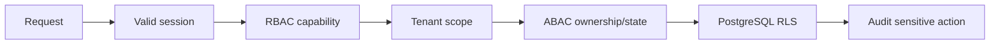
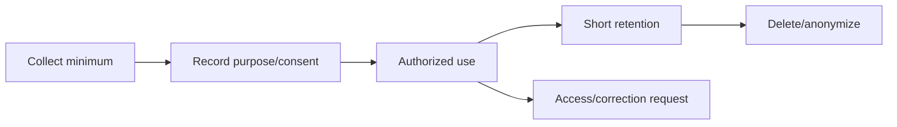

# Authentication, Authorization, Security & Privacy

## 1. Security objectives

- mencegah account takeover;
- mencegah cross-tenant data access;
- melindungi data customer, foto, alamat, dan dokumen verifikasi;
- memastikan payment, ledger, payout, dan admin action dapat diaudit;
- membatasi blast radius provider dan AI;
- menyediakan detection, response, recovery, dan evidence.

## 2. Authentication model

### Browser session

- Access token/session handle disimpan dalam cookie `HttpOnly`, `Secure`, `SameSite`.
- Access TTL pendek; refresh token dirotasi setiap penggunaan.
- Database menyimpan hash refresh token, device metadata minimal, expiry, dan revoke status.
- Token reuse menyebabkan revoke token family dan security event.
- Logout merevoke server-side session; logout-all merevoke seluruh user sessions.
- Password menggunakan modern adaptive hash (Argon2id yang dikonfigurasi dan di-benchmark).
- Email/phone verification token single-use, hashed, dan memiliki expiry.
- Recovery response tidak membocorkan apakah account terdaftar.

### Step-up/MFA

MFA wajib untuk:

- platform admin/verifier/finance;
- partner owner dan partner finance;
- perubahan rekening payout;
- payout/refund besar;
- role/permission mutation;
- export sensitif.

## 3. Authorization layers



Policy input tidak boleh berasal dari body/query tanpa dibandingkan dengan session context.

Contoh authorization intent:

```python
authorize(
    actor=current_actor,
    action="order.view",
    resource=order,
    context={"active_partner_id": active_partner_id},
)
```

Negative test wajib:

- customer A mencoba membaca order customer B;
- partner A mencoba UUID milik partner B;
- professional membaca booking yang tidak ditugaskan;
- finance role mengubah catalog;
- suspended partner melakukan write;
- revoked session menggunakan refresh token;
- admin tanpa step-up melakukan payout approval.

## 4. CORS, CSRF, XSS, and browser controls

### CORS

- allowlist origin eksplisit per environment;
- jangan gunakan `*` dengan credentials;
- batasi methods/headers;
- local origin tidak ikut production;
- CORS bukan authorization.

### CSRF

- SameSite cookie;
- CSRF token untuk request yang mengubah state;
- validate Origin/Referer untuk browser mutation;
- webhook/provider endpoint tidak memakai cookie auth.

### XSS

- manfaatkan React escaping default;
- larang `dangerouslySetInnerHTML` kecuali wrapper tersanitasi dan direview;
- sanitasi rich text partner menggunakan allowlist;
- Content Security Policy dengan nonce/hash;
- encode output sesuai context;
- file SVG dari user disanitasi atau dirasterisasi.

### Security headers baseline

```text
Content-Security-Policy: <environment-specific nonce policy>
Strict-Transport-Security: max-age=31536000; includeSubDomains
X-Content-Type-Options: nosniff
Referrer-Policy: strict-origin-when-cross-origin
Permissions-Policy: camera=(self), geolocation=(self)
Cross-Origin-Opener-Policy: same-origin
frame-ancestors 'none' (through CSP)
```

Policy CSP final harus diuji terhadap Next.js runtime dan provider yang benar-benar dipakai.

## 5. API threat controls

| Threat                | Control                                                                 |
| --------------------- | ----------------------------------------------------------------------- |
| BOLA/IDOR             | Object-level policy + tenant filter + RLS + negative tests              |
| Broken function auth  | Permission per command, deny-by-default                                 |
| SQL injection         | Parameterized ORM/query; no raw concatenation                           |
| SSRF                  | Provider allowlist, URL parser, block private/link-local, egress policy |
| Mass assignment       | Explicit request schema and command mapping                             |
| Resource exhaustion   | Body limit, upload limit, timeout, pagination cap, rate limit           |
| Replay                | Timestamp/nonce/signature, idempotency, event deduplication             |
| Credential stuffing   | Progressive rate limit, breached-password policy, alert                 |
| Enumeration           | Generic auth/recovery response                                          |
| Unsafe redirect       | Allowlist internal path/provider callback                               |
| Dependency compromise | Lockfile, SBOM, signature/provenance where available                    |

## 6. File and photo security

Upload flow:

1. API authorizes purpose dan membuat short-lived signed upload URL.
2. Client upload langsung ke private object storage.
3. Worker memverifikasi MIME menggunakan file signature, size, dimension, dan malware scan.
4. Image didecode/re-encode; metadata EXIF dihapus.
5. Object dipindah dari quarantine ke clean prefix.
6. Akses melalui signed download URL dengan TTL pendek.

Aturan:

- object key random; bukan filename user;
- bucket private;
- content disposition aman;
- SVG/HTML/script tidak diterima sebagai image biasa;
- foto wajah/skin memiliki consent dan retention khusus;
- verification document memiliki role/purpose restriction dan audit read.

## 7. Webhook security

- baca raw body sebelum parsing;
- verify signature constant-time;
- validate timestamp tolerance;
- deduplicate event ID;
- simpan minimal sanitized event metadata;
- acknowledge cepat lalu proses via worker;
- retry idempotent;
- fetch provider state bila urutan event meragukan;
- jangan percaya redirect browser sebagai payment success.

## 8. Data classification

| Class        | Contoh                                                         | Baseline                                         |
| ------------ | -------------------------------------------------------------- | ------------------------------------------------ |
| Public       | Published product/service                                      | Cache/CDN allowed                                |
| Internal     | Operational metrics, config non-secret                         | Auth + least privilege                           |
| Confidential | Email, phone, order, address                                   | Encryption, scoped access                        |
| Restricted   | Face/skin photo, health-adjacent answers, ID docs, payout data | Explicit purpose, step-up, short retention/audit |
| Secret       | Token, API key, encryption key                                 | Secret manager, never log                        |

## 9. Encryption and key management

- TLS untuk seluruh traffic.
- Storage/database encryption at rest dari provider.
- Field-level encryption untuk data restricted yang memerlukan pencarian terbatas.
- Encryption key terpisah dari database.
- Key version tersimpan agar rotasi memungkinkan.
- Password/token hash tidak dienkripsi secara reversible.
- Backup terenkripsi dan restore diuji.

## 10. Logging and audit

Structured log boleh mencakup:

- timestamp, level, service, environment;
- request ID, trace ID;
- route template, status, latency;
- actor/tenant pseudonymous ID;
- error code.

Jangan log:

- access/refresh token, cookie, password, OTP;
- full address, phone/email tanpa masking;
- payment payload mentah;
- foto atau signed URL;
- prompt berisi PII/restricted data;
- provider secret.

Audit event untuk perubahan role, verification, block/unblock, refund, payout, ledger
adjustment, document view, export, AI policy override, dan break-glass.

## 11. AI-specific security

- Anggap prompt, image OCR, product description, dan retrieved text sebagai untrusted data.
- Tool call hanya melalui typed allowlist.
- LLM tidak memperoleh database credential.
- Tool memeriksa authorization lagi; jangan mengandalkan prompt.
- Pisahkan instruction dan retrieved content.
- Batasi output/token/cost/time.
- Redact PII sebelum provider bila memungkinkan.
- Provider retention/training setting harus dikonfigurasi.
- Store prompt/output hanya bila purpose dan retention disetujui.
- Financial narrative wajib menyertakan metric snapshot/version.

## 12. Privacy lifecycle



Retention final adalah open decision. Data deletion harus mempertimbangkan legal hold,
ledger/audit obligations, dan anonymization untuk analytics.

## 13. Security gates

Sebelum staging:

- threat model per critical flow;
- auth/tenant negative tests;
- SAST, secret, dependency, container scan;
- security headers test;
- file upload abuse test;
- webhook signature/replay test.

Sebelum production:

- external penetration test untuk auth/payment/tenant;
- restore drill;
- incident response tabletop;
- least-privilege review;
- key rotation test;
- no unresolved critical/high finding.
