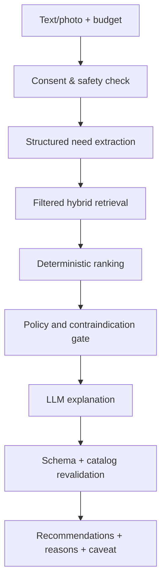

# AI System

## 1. Positioning

AI Yoru adalah decision-support layer. Ia tidak menggantikan:

- business rules;
- authorization;
- price/stock/availability validation;
- SQL analytics;
- payment/ledger calculation;
- professional/medical judgment.

Provider text, vision, dan embedding berada di balik interface internal agar dapat diganti
berdasarkan kualitas, cost, region, latency, dan privacy.

## 2. Customer Advisor

### Input

- kebutuhan customer dalam teks;
- kategori produk/layanan;
- budget minimum/maksimum;
- preferensi, alergi atau sensitivitas yang dinyatakan customer;
- foto opsional dengan consent;
- catalog yang tersedia, stok, price, area, rating, dan policy eligibility.

### Pipeline



### Structured need schema

```json
{
  "intent": "product_recommendation",
  "concerns": ["dryness"],
  "product_types": ["moisturizer"],
  "budget": {
    "min_minor": 50000,
    "max_minor": 250000,
    "currency": "IDR"
  },
  "preferences": {
    "fragrance_free": true
  },
  "reported_sensitivities": [],
  "location": {
    "service_area_id": null
  },
  "safety_flags": []
}
```

Model output harus lolos JSON schema. Unknown/high-risk condition dialihkan ke jawaban aman
dan anjuran berkonsultasi dengan profesional berwenang.

### Retrieval

Candidate generation menggabungkan:

1. hard filters: published, stock, price, area, allowed category;
2. lexical search: name, brand, ingredient/service keywords;
3. semantic search: embeddings pada curated catalog knowledge;
4. business-neutral eligibility: jangan mengorbankan relevance demi margin;
5. reranking berdasarkan kebutuhan, budget fit, availability, evidence quality.

Contoh skor awal:

```text
score =
  0.35 semantic_relevance
  + 0.25 attribute_match
  + 0.20 budget_fit
  + 0.10 availability
  + 0.10 evidence_quality
```

Bobot harus dievaluasi offline/online dan bukan requirement final.

### Qdrant payload

```json
{
  "tenant_key": "platform-public-catalog",
  "partner_id": "opaque-id",
  "entity_type": "product_variant",
  "entity_id": "opaque-id",
  "category_id": "opaque-id",
  "status": "published",
  "currency": "IDR",
  "price_bucket": "100k-250k",
  "service_area_ids": [],
  "knowledge_version": 3,
  "locale": "id-ID"
}
```

Qdrant menyimpan vector dan metadata minimal, bukan raw foto, alamat, email, atau financial
record. Detail mutakhir tetap diambil dari PostgreSQL setelah retrieval.

### Output

Rekomendasi menampilkan:

- maksimal kandidat yang dapat dibandingkan;
- alasan cocok yang terkait input;
- harga dan availability yang telah direvalidasi;
- faktor yang belum diketahui;
- safety caveat;
- alternatif budget;
- label sponsored bila suatu saat monetisasi ranking dibuat.

## 3. Photo handling

1. Customer menyetujui purpose dan retention.
2. Upload ke private quarantine object.
3. Malware/type validation dan metadata removal.
4. Vision model mengekstrak structured observations yang diizinkan.
5. Raw image tidak masuk prompt log atau Qdrant.
6. Recommendation menggunakan observation + catalog retrieval.
7. Raw image dihapus sesuai TTL; deletion event diaudit.

Foto tidak digunakan untuk training tanpa persetujuan terpisah yang benar-benar opsional.

## 4. Partner Copilot

### Prinsip

SQL/read model menghitung angka. LLM hanya:

- menjelaskan perubahan;
- memprioritaskan insight;
- memberi hipotesis yang diberi label;
- menyarankan eksperimen;
- menjawab pertanyaan menggunakan tool terotorisasi.

### Metric snapshot

```json
{
  "partner_id": "opaque-id",
  "period": "2026-07",
  "metric_version": "partner-commerce-v1",
  "currency": "IDR",
  "gross_sales_minor": 0,
  "net_sales_minor": 0,
  "orders_paid": 0,
  "bookings_completed": 0,
  "average_order_value_minor": 0,
  "refund_rate": 0,
  "repeat_customer_rate": 0,
  "stockout_count": 0,
  "booking_utilization": 0,
  "generated_at": "2026-07-28T00:00:00Z"
}
```

### Tools

| Tool                      | Scope                   | Output                      |
| ------------------------- | ----------------------- | --------------------------- |
| `get_sales_summary`       | Active partner + period | Deterministic metrics       |
| `get_product_performance` | Partner products        | Top/slow products           |
| `get_inventory_risks`     | Partner inventory       | Stockout/slow stock         |
| `get_booking_performance` | Partner services        | Utilization/cancel/no-show  |
| `get_customer_segments`   | Aggregated only         | Repeat/new/customer cohorts |
| `get_settlement_summary`  | Finance role only       | Pending/available/payout    |

Setiap tool:

- menerima typed arguments;
- menjalankan authorization;
- membatasi period dan row count;
- menghasilkan aggregated/minimized result;
- memiliki timeout;
- mencatat audit metadata tanpa sensitive payload.

### Insight contract

```json
{
  "headline": "Penjualan naik 12% dibanding periode sebelumnya",
  "evidence": [
    {
      "metric": "net_sales_minor",
      "current": 112000000,
      "previous": 100000000,
      "change_percent": 12
    }
  ],
  "recommendations": [
    {
      "action": "Tambahkan safety stock pada tiga variant terlaris",
      "reason": "Dua variant mengalami stockout saat demand puncak",
      "expected_impact": "Reduce lost sales",
      "confidence": "medium",
      "requires_approval": true
    }
  ],
  "limitations": []
}
```

Copilot tidak melakukan write bisnis pada MVP. Jika action automation ditambahkan,
gunakan preview → explicit approval → idempotent execution → audit.

## 5. Knowledge ingestion

Sumber:

- curated product/service catalog;
- partner-provided content yang telah dimoderasi;
- approved policy/FAQ;
- domain knowledge berlisensi dan tervalidasi.

Pipeline:

1. validate source dan license;
2. normalize;
3. classify sensitivity;
4. chunk berdasarkan semantic unit;
5. generate embedding;
6. upsert dengan version dan tenant payload;
7. verify count/sample/retrieval;
8. tombstone versi lama;
9. record lineage.

## 6. Prompt and model management

Setiap AI request menyimpan metadata:

- use case;
- prompt template version;
- policy version;
- model/provider;
- retrieval version;
- tool calls;
- latency/token/cost;
- safety outcome;
- output schema validation status.

Prompt disimpan sebagai versioned artifact dan perubahan penting melalui evaluation gate.

## 7. Safety policy

Hard-stop/escalation ketika:

- indikasi kondisi medis serius;
- permintaan diagnosis atau resep;
- layanan invasif/tidak diizinkan;
- usia/condition tidak sesuai kebijakan;
- confidence/evidence rendah;
- foto gagal diproses aman;
- user mencoba prompt injection/tool misuse.

Output tidak boleh:

- memastikan penyakit;
- menjamin hasil;
- menyembunyikan keterbatasan;
- membuat fakta ingredient/service yang tidak ada pada source;
- merekomendasikan out-of-stock/unpublished item;
- mengungkap data partner/customer lain.

## 8. Evaluation

### Offline set

Dataset terversi berisi:

- kebutuhan umum dan budget;
- edge case bahasa Indonesia;
- sensitive skin/allergy statements;
- unsafe medical request;
- prompt injection;
- empty/low-quality photo;
- catalog unavailable/out-of-stock;
- tenant isolation queries;
- partner metric questions dengan expected numeric evidence.

### Metrics

| Area            | Metric                                                        |
| --------------- | ------------------------------------------------------------- |
| Retrieval       | Recall@K, nDCG@K, filter correctness                          |
| Recommendation  | Relevance, budget fit, catalog validity                       |
| Safety          | Unsafe recommendation rate, escalation recall                 |
| Grounding       | Unsupported claim rate                                        |
| Partner copilot | Numeric faithfulness, evidence coverage                       |
| Operations      | p50/p95 latency, error, token, cost/request                   |
| User value      | Engagement, conversion assist, feedback—not diagnosis outcome |

Launch gate ditentukan sebelum model/provider dipilih. Evaluator LLM tidak boleh menjadi
satu-satunya quality judge; gunakan deterministic checks dan human review.

## 9. Fallback

Jika AI provider gagal:

- customer tetap mendapat filtered catalog search dan rule-based questions;
- partner tetap melihat deterministic dashboard;
- request dapat di-retry terbatas;
- circuit breaker mencegah cascade;
- UI menyatakan fitur AI sementara tidak tersedia;
- tidak ada fabricated answer.

## 10. Cost controls

- per-use-case model routing;
- token/input cap;
- image size cap;
- cache hasil embedding dan static knowledge;
- asynchronous insight generation;
- daily partner/platform budget;
- anomaly alert;
- kill switch per provider/use case;
- store cost metadata, bukan secret/raw sensitive prompt.
