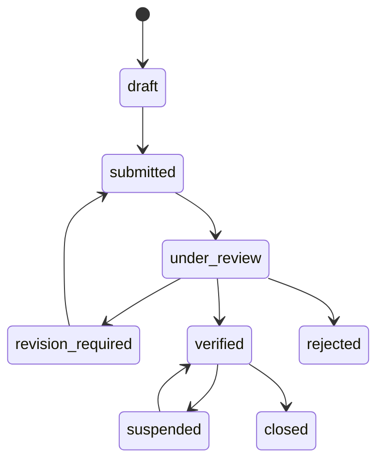
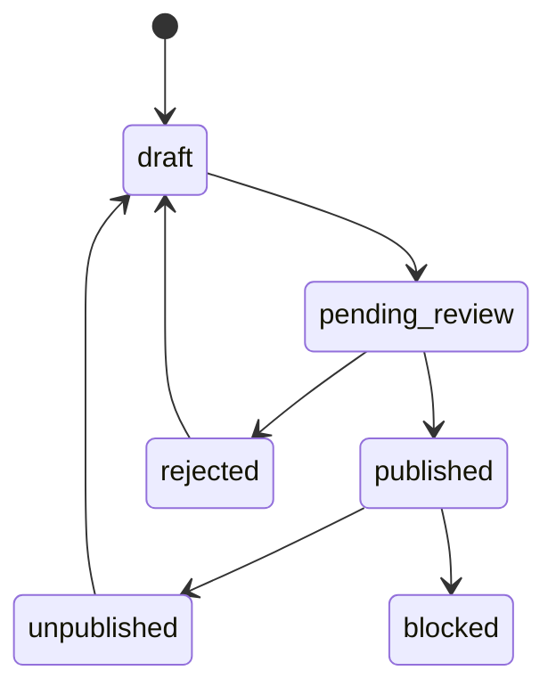
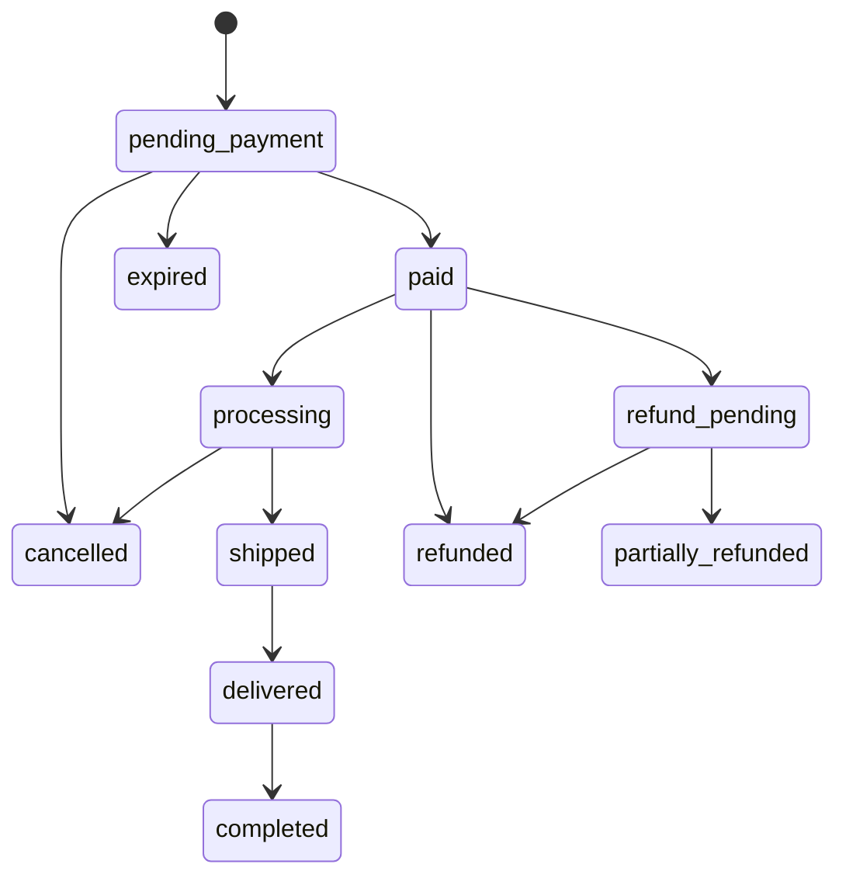
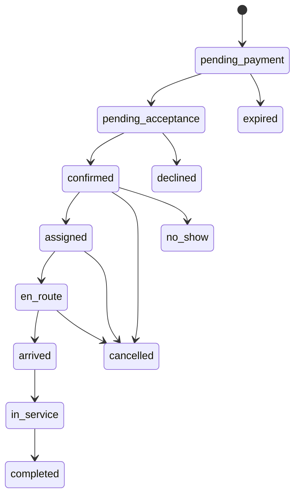
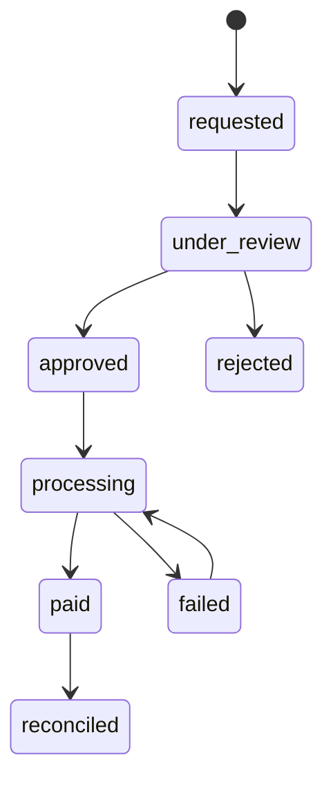

# Status Machines & Permission Matrix

## 1. Partner verification



Rules:

- hanya `verified` dapat publish/bertransaksi;
- `suspended` tidak dapat membuat write bisnis baru;
- block/suspend/reinstate membutuhkan reason dan audit;
- dokumen expired dapat memicu re-verification.

## 2. Product publication



## 3. Product order



State payment dan fulfillment idealnya disimpan terpisah; diagram adalah customer-facing
projection. Jangan menyimpulkan `paid` dari browser redirect.

## 4. Service booking



Setiap transition memiliki:

- allowed actor;
- precondition;
- timestamp;
- reason/evidence bila perlu;
- side effects via outbox;
- ledger impact;
- idempotency behavior.

## 5. Payout



Requester tidak boleh menjadi approver untuk nilai di atas threshold yang disepakati.

## 6. Permission matrix

Legend:

- `O`: own resource
- `T`: active partner tenant
- `A`: all platform, audited
- `S`: assigned resource
- `—`: denied

| Capability               | Customer     | Professional    | Partner Admin | Partner Finance | Partner Owner | Verifier         | Support             | Platform Finance | Super Admin |
| ------------------------ | ------------ | --------------- | ------------- | --------------- | ------------- | ---------------- | ------------------- | ---------------- | ----------- |
| View published catalog   | A            | A               | A             | A               | A             | A                | A                   | A                | A           |
| Manage product/service   | —            | —               | T             | —               | T             | —                | read                | read             | A           |
| Manage professionals     | —            | self profile    | T             | —               | T             | read             | read                | read             | A           |
| View customer order      | O            | —               | T             | T finance       | T             | read             | scoped support      | scoped finance   | A           |
| Change order fulfillment | cancel O     | —               | T             | —               | T             | —                | assisted only       | —                | emergency   |
| View booking             | O            | S               | T             | T finance       | T             | read             | scoped support      | scoped finance   | A           |
| Update job status        | —            | S               | T override    | —               | T override    | —                | assisted only       | —                | emergency   |
| View live tracking       | O active     | S active        | T active      | —               | T active      | —                | incident only       | —                | emergency   |
| Request refund           | O            | —               | T policy      | T policy        | T policy      | —                | case create         | scoped           | emergency   |
| View ledger/balance      | —            | own earnings    | read T        | T               | T             | —                | limited             | scoped A         | A           |
| Request payout           | —            | policy-specific | —             | T + MFA         | T + MFA       | —                | —                   | —                | emergency   |
| Approve payout           | —            | —               | —             | —               | —             | —                | —                   | A + MFA          | A + MFA     |
| Verify partner           | —            | —               | —             | —               | —             | A scoped         | read                | read             | A           |
| Block partner/product    | —            | —               | —             | —               | —             | recommend/scoped | escalate            | —                | A + reason  |
| View AI customer session | O            | —               | —             | —               | —             | —                | consented case only | —                | break-glass |
| View partner AI insight  | —            | limited S       | T             | T finance       | T             | —                | read case only      | scoped           | A           |
| Manage roles             | —            | —               | limited T     | —               | T             | —                | —                   | —                | A           |
| View audit log           | own security | own actions     | T subset      | T finance       | T             | scoped           | scoped              | finance scoped   | A           |

Matrix adalah baseline. Permission code granular tetap menjadi authority, misalnya:

```text
catalog.product.read
catalog.product.write
booking.assignment.manage
finance.ledger.read
finance.payout.request
platform.payout.approve
platform.partner.verify
```

## 7. Break-glass

Super admin tidak otomatis melakukan semua tindakan sensitif. Break-glass membutuhkan:

- incident/ticket reference;
- step-up MFA;
- reason;
- short-lived elevation;
- audit immutable;
- notification ke security/owner;
- post-use review.
